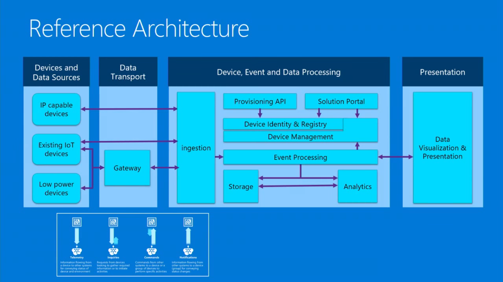
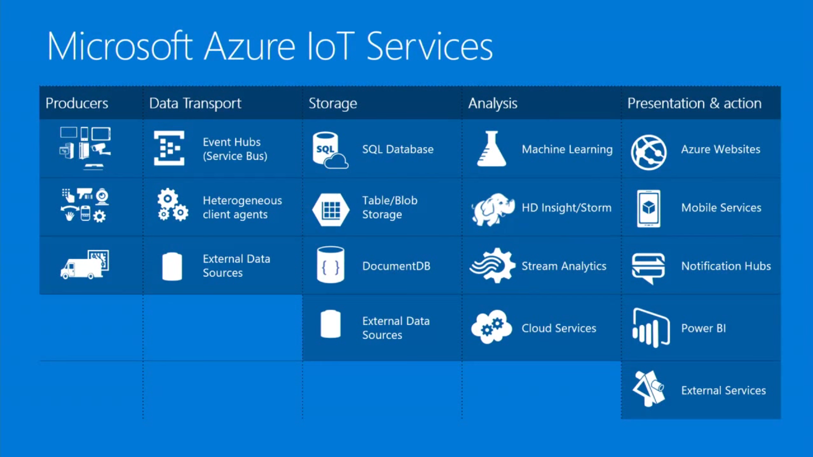
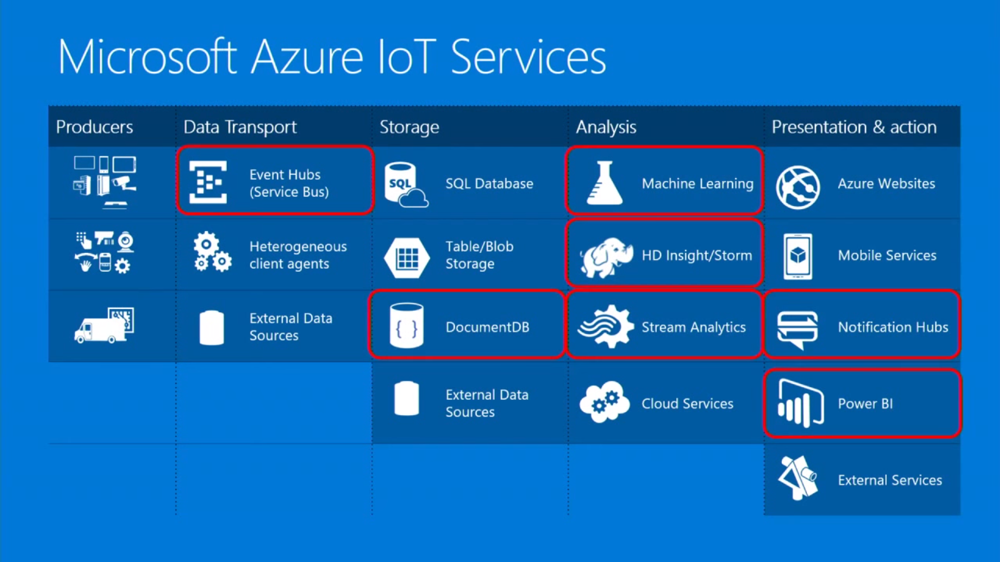

# Presentations

# Microsoft Build 2016

# Architecting the Internet of Things

> This session will give a brief overview of what IoT is from the perspective of an Architect within Consulting Services. We will look at what kinds of projects we are getting involved in, what those projects look like in reality, the kinds of challenges you will face, the network you need to succeed, and the risks involved. This session will move beyond hypotheticals and introduce real world examples that will help you prepare for life as a delivery architect working with IoT. [Architecting the Internet of Things by Microsoft @ TechEd North America](https://www.youtube.com/watch?v=ZMHQu_X0Ijk)

> Collecting information from lots of devices is cool - but it is just __telematics__. Merging perspectives between devices, systems, and humans to build a better understanding of the world around us. But tying together __insight__ with __action__ - there lies the promise of IoT. 

Objectives

- Understand what IoT means for IT Architects
- Learn the tecnologies and how to begin applying  them to deliver a modern IoT project
- Be better able to talk to Customers about IoT

Session Overview

- What is IoT and why it is important
- IoT from an Architect's perspective
- Technologies Architects need to know
- Common pattern and practices
- Quick real world examples

Expectations

- Level 200 Architecture Session
- There will be no code
- There will be no "flashing light" demos

## IoT: The Internet of Things

> The network of physical objects that contain embedded technology to communicate  and interact with their external states or the external environment. Gartner Definition

> 20 billion devices by 2020. Gartner

### What is it?

- Unique objects connected to the Internet
- Devices, not people
- Bi-directional communication
- Large, complex data flows
- New types of insight

Example 31% Cowwy ROI Beef Industry! [The Internet of Cows: Azure-powered pedometers get dairies mooovin’](http://arstechnica.com/information-technology/2015/04/the-internet-of-cows-azure-powered-pedometers-get-dairies-mooovin/)

### Why is it important?

> Worlwide market for IoT solutions to reach $7.2 trillion in 2010 (IDC). Economic value-add is forecast to be $1.9 trillion across sectors in 2020 (Gartner)

> Leading Industry Examples: Utilities, Insurance, Agriculture, Factory, Automobiles, Transport, Consumer

### The Gartner Hype Cycle

## An Architect's Perspective

### POV: IoT is at an inflection point

- Hardware is getting cheap
- M2M solutions are mainstream
- Connectivity is proliferating
- Software is more advanced
- Cloud cost, scale, flexibility

Example Talk Design Thinking [Microsoft CityNext: Helping Guide Dogs support people with sight loss](https://blogs.msdn.microsoft.com/ukgovernment/2014/01/15/microsoft-citynext-helping-guide-dogs-support-people-with-sight-loss/)

### General Technical Requirements for IoT

- Many Devices
- Large Scale
- Vague Security Requirements
- Volumes of Data
- End to End Integration

### Information Exchange Patterns

Basics of IoT Communication

- Telemetry: Information flowing from a device to other systems for conveying status of device and environment
- Inquiries: Requests from devices looking to gather required information or to initiate activities, I Am Ok!
- Commands: Command from other systems to a device or a group of devices to perform specific activities
- Notifications: Information flowing from other systems to a device (group) for conveying status changes

### IoT Solutions

> A service-oriented architecture (SOA) is an architectural pattern in computer software design in which application components provide services to other components via a communications protocol, typically over a network. The principles of service-orientation are independent of any vendor, product or technology. [Wikipedia](https://en.wikipedia.org/wiki/Service-oriented_architecture)

> SOA may introduce problems later on on IoT solutions

#### How to solve those basic patterns

- Endpoints
- Message Passing
- Message Security
- Publish-Subscribe
- Command Routing

#### IoT Challenges, First Principles

- Addressing
- Scale
- Connectivity
- Data Volume
- Device Size

Example [Scania Leads a New Era of Trucking Services with Data and the Cloud](http://blogs.microsoft.com/transform/2015/03/12/scania-leads-a-new-era-of-trucking-services-with-the-data-and-the-cloud/#sm.0000mrabe0vnsfn3t6n1ne7t3zc05)

#### First Principles

- Addressing, Pub/Sub
- Scale, Cloud
- Connectivity, Queues
- Data Volume, Cloud Storage
- Device Size, AMQP/MQTT

#### Reference Architecture

### What Do Architects Need to Know

#### Depth?

### Data Transport: Event Hubs (Service Bus)

> Telemetry Ingestion Services

20 MB files? Wrong Architecture!
Event Hubs? Example with 360 Gaming Console, Online Games!

### Storage: DocumentDB

> Fully Managed NoSQL document db service

Integrates with big data solutions

### Analysis: Azure HDInsight

> 100% Apache Hadoop-based service in the Cloud

### Analysis: Azure Stream Analytics

> Process real-time data in Azure . "Data in Motion"

### Analysis: Azure Machine Learning

> Cloud bsaed predictive analytics engine

- Data sources: Raw Materials
- Ingest: Acquire Raw Materials
- Transform and Analyze: Transform raw materials into "finished goods" 
- Publish: Deliver

### Presentation and Action: Axure Notification Hubs

> Scalable mobile push notification engine

### Presentation and Action: Microsoft PowerBI

> Live, single pane of glass dashboard solution for visualizations and KPIs

## IoT Device & Cloud Patterns

## Risks of IoT

- Old ways of Thinking can be dangerous
- Understand the business model
- Be aware of new patterns: eventual consistency, etc.
- Don't focus on the device
- Avoid analysis paralysis. Get it done!

## Summary

- Architecture is the Center of IoT
- IoT is Advanced Modern Architecture
- IoT Projects are Complex - Teamwork is necessary
- These projects are mission critical and difficult
- We can't learn everything - but we need to breadth
- Don't be afraid - get started and learn

# Microsoft IoT Platform: Architecture Overview

[Microsoft IoT Platform: Architecture Overview](https://www.youtube.com/watch?v=q6lYuUJ1mO4)